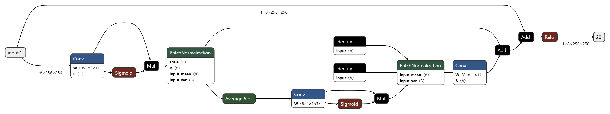

# Low Resource Keyword Detection



An implementation of the model architecture presented by Qualcomm ([arxiv link](https://arxiv.org/pdf/2106.04140.pdf)) for low resource keyword detection, the following repository implements a model according to the architecture outlined by them, and performs accurately on Googles speech_keyword dataset. There is a corresponding Medium [article](https://medium.com/@joeldeodhar/are-apple-amazon-always-listening-to-you-an-analysis-of-low-resource-keyword-detection-89e98e85d94c) that delves into the background and a step by step build walk through of the model which I strongly recommend checking out.

# Installation

### First clone the repository
```commandline
git clone https://github.com/Joel-De/Keyword-Detection.git
cd Keyword-Detection
```

In your created virtual environment run the following:
```commandline
pip install -r requirements.txt
```
If you would instead like a GPU accelerated instance of pytorch you can install the corresponding version from Pytorch's [official page](https://pytorch.org/)


### Alternatively, if you want to use pipenv, run the following:

#### For Pytorch with only CPU support
```commandline
pipenv install -v --categories "packages pytorch_cpu"
```

#### For pytorch with only CPU+GPU (Cuda 11.8) support

```commandline
pipenv install -v --categories "packages pytorch_cuda"
```

To activate the virtual environment run
```commandline
pipenv shell
```


# Dataset
If you wish to train the network you'll need to download and preproces the dataset first.
The dataset used is Google's [speech_commands](tensorflow.org/datasets/catalog/speech_commands) dataset, this can be downloaded [directly](http://download.tensorflow.org/data/speech_commands_v0.02.tar.gz). Once downloaded, run the following python script in order to preprocess the dataset.

```commandline
python generate_dataset.py --source_dir "Path/to/downloaded/dataset" --export_dir "Path/to/where/dataset/should/be/saved"
```

Additionally, you can specify --cpu_threads and provide the number of worker threads to use in the generation process, by default it uses all available threads on a system.

Functionally, this script overlays the original data with background noise, and adds some preliminary augmentations.

Note that at this time training on custom data isn't supported, thought it might be added in the future.


# Training

To train the network using default settings run the following commands:

First launch an mlflow server which will be used to log metrics and model checkpoints (you can skip this if you already have an instance running and instead pass the tracking URI as an argument to the training script)
```commandline
mlflow server
```

Next you can run the train script as follows, if you want to log to a mlflow server that isn't hosted on the default address, pass the tracking URI as an input parameter
```commandline
python train.py --dataset_dir "Path/to/processed/dataset"
```

Note that there are a multitude of other arguments, this can be further explored by running

```commandline
python train.py -h
```

which will provide a list of available arguments as well as their function

# Inference / Testing

There is a provided model in ./resources/model.pth, trained on the above mentioned dataset. To run inference, FFmpeg libraries will need to be installed as they are a direct dependency of torchaudio's StreamReader. Note that this is specifically the dynamic libraries and not the commandline utility itself. 

As such you'll likely need to install ffmpeg with an option analogous to --shared

The following is an example of the command required to run inference:

```commandline
python inference.py --model_dir "resources/model.pth" --audio_source "Microphone (Realtek(R) Audio)" --audio_format "dshow"
```

More detailed instructions / resources can be found by running:

```commandline
python inference.py -h
```

### Citations:

Kim, Byeonggeun, et al. "Broadcasted residual learning for efficient keyword spotting." arXiv preprint arXiv:2106.04140 (2021).